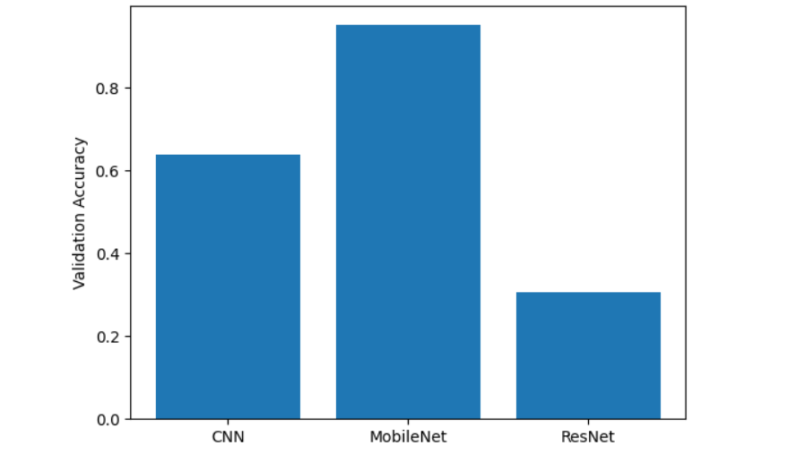
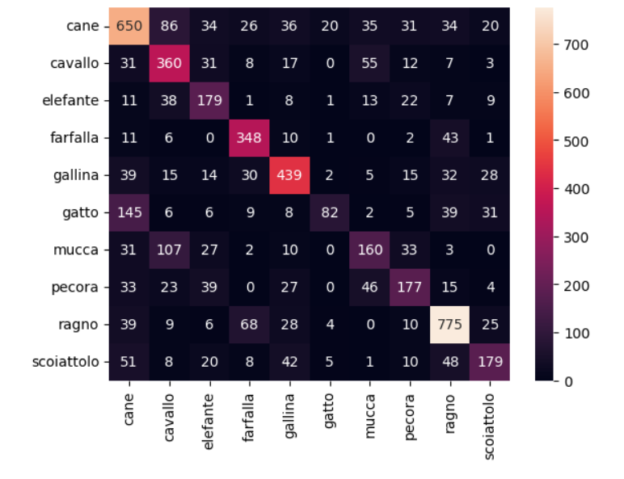

# 🐾 Animal Image Classification using Deep Learning

## 📌 Project Overview

This project is a Deep Learning-based image classification system that identifies animals from images.  
Given an input image, the model predicts the animal category such as **cat, dog, horse, elephant, butterfly, etc.**

We compare multiple architectures including:
- Custom CNN (baseline model)
- ResNet50 (transfer learning)
- MobileNetV2 (optimized lightweight model)

The goal is to analyze performance differences between architectures and build a deployment-ready AI system.

---

## 📊 Dataset

We use the **Animals-10 dataset** from Kaggle:

check dataset [here](https://www.kaggle.com/datasets/alessiocorrado99/animals10)

### Classes include:
- dog
- cat
- horse
- spider
- butterfly
- chicken
- sheep
- cow
- squirrel
- elephant

---

## 🧠 Models Used

### 1. Custom CNN (Baseline)
- Simple convolutional neural network
- Used for baseline comparison
- Helps understand underfitting/overfitting behavior

### 2. ResNet50 (Transfer Learning)
- Pretrained on ImageNet
- Fine-tuned last layers
- Strong feature extractor but slower convergence

### 3. MobileNetV2 (Best Model)
- Lightweight architecture
- Fast convergence
- Best accuracy-performance tradeoff

---

## 📈 Results Summary

| Model        | Validation Accuracy | Comments |
|--------------|--------------------|----------|
| CNN          | ~60–70%            | Baseline, limited capacity |
| ResNet50     | ~40%               | Stable but slower learning |
| MobileNetV2  | ~85–93%            | Best performing model |

📌 Final selected model: **MobileNetV2**

---

## 🖼️ Model Pipeline

1. Image loading from dataset
2. Preprocessing (resize, normalization)
3. Data augmentation (rotation, zoom, flip)
4. Model training
5. Evaluation (accuracy, loss, confusion matrix)
6. Prediction on new images

---

## 📊 Evaluation Metrics

- Accuracy
- Loss curves
- Confusion Matrix
- Classification Report (Precision, Recall, F1-score)

---

## 🚀 Streamlit Web App (Bonus Feature)

A simple web interface allows users to upload an image and get predictions in real time.
[Live Demo](https://deep-learning-tdwmynhaccejvua2kxkzpw.streamlit.app)

## Screenshots





### Run the app:

```bash
streamlit run app/app.py
